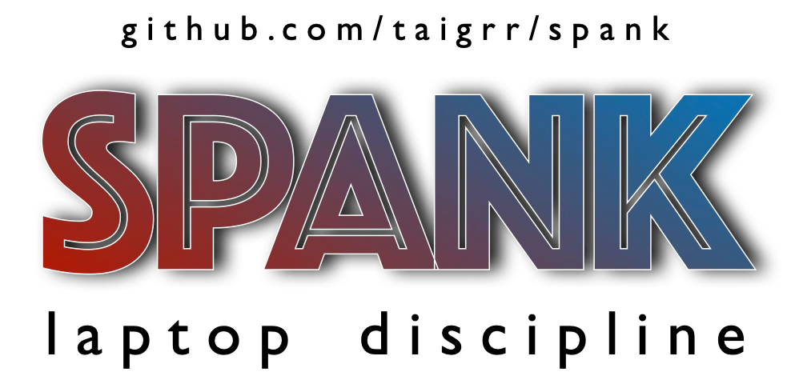

<p align="center">
  
</p>

# spank

**English** | [简体中文][readme-zh-link]

Slap your MacBook, it yells back.

> "this is the most amazing thing i've ever seen" — [@kenwheeler](https://x.com/kenwheeler)

> "I just ran sexy mode with my wife sitting next to me...We died laughing" — [@duncanthedev](https://x.com/duncanthedev)

> "peak engineering" — [@tylertaewook](https://x.com/tylertaewook)

Uses the Apple Silicon accelerometer (Bosch BMI286 IMU via IOKit HID) to detect physical hits on your laptop and plays audio responses. Single Rust binary, no separate daemon.

## Requirements

- macOS on Apple Silicon (any M-series chip M2 or greater, or the M1 Pro SKU specifically, no other M1/A-series chips!)
- `sudo` (for IOKit HID accelerometer access)
- Rust toolchain with Cargo (for installation)

## Install

Install with Cargo:

```bash
cargo install --git https://github.com/taigrr/spank spank
```

From a local checkout:

```bash
cargo install --path .
```

> **Note:** `cargo install` places the binary in `~/.cargo/bin` by default. Copy it to a system path so `sudo spank` works:
>
> ```bash
> sudo cp "$HOME/.cargo/bin/spank" /usr/local/bin/spank
> ```

## Usage

Default runs open an interactive terminal UI showing current mode, settings, the latest slap, and the event log. Sound packs and runtime settings can be changed inside the TUI; CLI flags only set the initial state or select `--stdio` integration mode.

TUI controls:

- `q`, `Esc`, or `Ctrl-C`: quit
- `Space` or `p`: pause/resume detection
- `v`: toggle volume scaling
- `Up`/`Down`: select a control
- `Left`/`Right`: adjust the selected control
- `Enter`: apply/toggle/edit the selected control
- `m`: cycle sound pack
- `f`: toggle default/fast tuning
- `e`: edit custom source

Custom source accepts an MP3 directory or comma-separated MP3 files.

```bash
# Open the TUI; switch modes and settings inside the UI
sudo spank

# Optional initial state
sudo spank --sexy
sudo spank --halo
sudo spank --fast
sudo spank --sexy --fast
sudo spank --custom /path/to/mp3s
sudo spank --custom-files /path/a.mp3,/path/b.mp3
sudo spank --min-amplitude 0.1
sudo spank --cooldown 600
sudo spank --speed 0.7

# JSON stdin/stdout mode for scripts, launchd, and other integrations
sudo spank --stdio
```

### Modes

**Pain mode** (default): Randomly plays from 10 pain/protest audio clips when a slap is detected.

**Sexy mode** (`--sexy`): Tracks slaps within a rolling 5-minute window. The more you slap, the more intense the audio response. 60 levels of escalation.

**Halo mode** (`--halo`): Randomly plays from death sound effects from the Halo video game series when a slap is detected.

**Custom mode** (`--custom`): Randomly plays MP3 files from a custom directory you specify.

### Detection tuning

Use the TUI to toggle the fast profile for faster polling (4ms vs 10ms), shorter cooldown (350ms vs 750ms), and larger sample batch (320 vs 200).

You can adjust `min-amplitude`, `cooldown`, `speed`, `volume-scaling`, sound pack, and custom audio source while the app is running.

### Sensitivity

Control detection sensitivity with `--min-amplitude` (default: `0.05`):

- Lower values (e.g., 0.05-0.10): Very sensitive, detects light taps
- Medium values (e.g., 0.15-0.30): Balanced sensitivity
- Higher values (e.g., 0.30-0.50): Only strong impacts trigger sounds

The value represents the minimum acceleration amplitude (in g-force) required to trigger a sound.

## Running as a Service

To have spank start automatically at boot, create a launchd plist. Services should use `--stdio` because the default mode is an interactive TUI. Pick your mode:

<details>
<summary>Pain mode (default)</summary>

```bash
sudo tee /Library/LaunchDaemons/com.taigrr.spank.plist > /dev/null << 'EOF'
<?xml version="1.0" encoding="UTF-8"?>
<!DOCTYPE plist PUBLIC "-//Apple//DTD PLIST 1.0//EN"
  "http://www.apple.com/DTDs/PropertyList-1.0.dtd">
<plist version="1.0">
<dict>
    <key>Label</key>
    <string>com.taigrr.spank</string>
    <key>ProgramArguments</key>
    <array>
        <string>/usr/local/bin/spank</string>
        <string>--stdio</string>
    </array>
    <key>RunAtLoad</key>
    <true/>
    <key>KeepAlive</key>
    <true/>
    <key>StandardOutPath</key>
    <string>/tmp/spank.log</string>
    <key>StandardErrorPath</key>
    <string>/tmp/spank.err</string>
</dict>
</plist>
EOF
```

</details>

<details>
<summary>Sexy mode</summary>

```bash
sudo tee /Library/LaunchDaemons/com.taigrr.spank.plist > /dev/null << 'EOF'
<?xml version="1.0" encoding="UTF-8"?>
<!DOCTYPE plist PUBLIC "-//Apple//DTD PLIST 1.0//EN"
  "http://www.apple.com/DTDs/PropertyList-1.0.dtd">
<plist version="1.0">
<dict>
    <key>Label</key>
    <string>com.taigrr.spank</string>
    <key>ProgramArguments</key>
    <array>
        <string>/usr/local/bin/spank</string>
        <string>--stdio</string>
        <string>--sexy</string>
    </array>
    <key>RunAtLoad</key>
    <true/>
    <key>KeepAlive</key>
    <true/>
    <key>StandardOutPath</key>
    <string>/tmp/spank.log</string>
    <key>StandardErrorPath</key>
    <string>/tmp/spank.err</string>
</dict>
</plist>
EOF
```

</details>

<details>
<summary>Halo mode</summary>

```bash
sudo tee /Library/LaunchDaemons/com.taigrr.spank.plist > /dev/null << 'EOF'
<?xml version="1.0" encoding="UTF-8"?>
<!DOCTYPE plist PUBLIC "-//Apple//DTD PLIST 1.0//EN"
  "http://www.apple.com/DTDs/PropertyList-1.0.dtd">
<plist version="1.0">
<dict>
    <key>Label</key>
    <string>com.taigrr.spank</string>
    <key>ProgramArguments</key>
    <array>
        <string>/usr/local/bin/spank</string>
        <string>--stdio</string>
        <string>--halo</string>
    </array>
    <key>RunAtLoad</key>
    <true/>
    <key>KeepAlive</key>
    <true/>
    <key>StandardOutPath</key>
    <string>/tmp/spank.log</string>
    <key>StandardErrorPath</key>
    <string>/tmp/spank.err</string>
</dict>
</plist>
EOF
```

</details>

> **Note:** Update the path to `spank` if you installed it elsewhere (e.g. `~/.cargo/bin/spank`).

Load and start the service:

```bash
sudo launchctl load /Library/LaunchDaemons/com.taigrr.spank.plist
```

Since the plist lives in `/Library/LaunchDaemons` and no `UserName` key is set, launchd runs it as root — no `sudo` needed.

To stop or unload:

```bash
sudo launchctl unload /Library/LaunchDaemons/com.taigrr.spank.plist
```

## How it works

1. Reads raw accelerometer data directly via IOKit HID (Apple SPU sensor)
2. Runs vibration detection (STA/LTA, CUSUM, kurtosis, peak/MAD)
3. Shows live status, settings, latest slap details, and event history in the TUI
4. When a significant impact is detected, plays an embedded MP3 response
5. **Optional JSON mode** (`--stdio`) for scripts, launchd, and integrations
6. **Optional volume scaling** (`--volume-scaling`) — light taps play quietly, hard slaps play at full volume
7. **Optional speed control** (`--speed`) — adjusts playback speed and pitch (0.5 = half speed, 2.0 = double speed)
8. 750ms cooldown between responses to prevent rapid-fire, adjustable with `--cooldown`

## Star History

[](https://www.star-history.com/#taigrr/spank&type=date&legend=top-left)

## Credits

Sensor reading and vibration detection ported from [olvvier/apple-silicon-accelerometer](https://github.com/olvvier/apple-silicon-accelerometer).

## License

MIT

<!-- Links -->
[readme-zh-link]: ./README-zh.md
